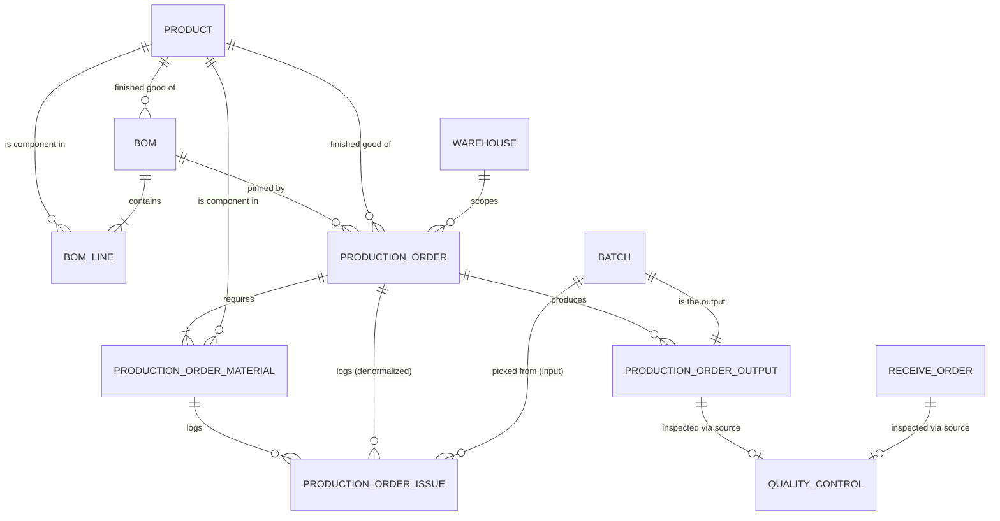

# 01. Schema, state machine, permissions

Read `CONTEXT.md` first for vocabulary. Column types assume MariaDB 10.6+ and Laravel migrations.

**Quantity precision:** use the same `decimal` precision your stock tables use. Below, `qty` means `decimal(18,4)`. Per-unit BOM rates get 6 decimals because they are multiplied by large targets. Never use floats anywhere in this module.

## Tables at a glance

| Table | Role | Mutable? |
|---|---|---|
| `boms` | Recipe header, versioned | Draft only |
| `bom_lines` | Recipe contents | Draft only |
| `production_orders` | The commitment | By state machine only |
| `production_order_materials` | Frozen requirement per component, plus cached rollups | Rollups only |
| `production_order_issues` | Append-only events: issue, return, write_off | Never |
| `production_order_outputs` | Batches produced | Never after completion |

## `boms`
| Column | Type | Notes |
|---|---|---|
| id | pk | |
| product_id | fk products | The finished good |
| version | unsigned int | Unique with product_id |
| status | string(20) | `draft`, `active`, `retired` (PHP backed enum) |
| active_product_id | bigint null, **stored generated** | `CASE WHEN status='active' THEN product_id END`, **unique index** |
| notes | text null | |
| created_by, activated_by, activated_at | | |
| timestamps | | |

`active_product_id` enforces "one active BOM per product" in the database. MariaDB has no partial unique index, but a unique index ignores NULLs, so only active rows compete. In Laravel: `->storedAs("CASE WHEN status = 'active' THEN product_id END")->nullable()->unique()`.

Unique: `(product_id, version)`.

## `bom_lines`
| Column | Type | Notes |
|---|---|---|
| id, bom_id | | fk boms, cascade on delete (drafts only) |
| component_product_id | fk products | Any product type (Sub-assemblies allowed) |
| quantity_per_unit | decimal(18,6) | Rate: amount per one unit of finished good |
| uom | string | Denormalized copy; must equal the component's stock UoM |
| scrap_percentage | decimal(5,2) default 0 | `5.00` means 5% extra |
| notes | | |

Unique: `(bom_id, component_product_id)`. CHECK: `quantity_per_unit > 0 AND scrap_percentage >= 0 AND scrap_percentage <= 100`.

Validation on save: component is not the BOM's own product; `uom` equals the component's stock UoM. On **activation**: reject cycles (A uses B, B uses A). This is a one-time graph walk at activation, not a runtime recursion. It exists only to keep the data sane, since sub-assemblies are never auto-exploded.

## `production_orders`
| Column | Type | Notes |
|---|---|---|
| id, order_number | | Unique. Reuse your existing document numbering scheme |
| product_id | fk | Finished good |
| bom_id | fk boms | Pinned BOM version |
| warehouse_id | fk | Where material is issued from and outputs land. Drop if you have a single warehouse |
| target_quantity | qty | > 0 |
| uom | string | Copied from product |
| status | string(20) | `draft`, `released`, `in_progress`, `completed`, `cancelled` |
| planned_start_date, planned_end_date | date null | Informational in v1 |
| produced_quantity | qty null | Sum of primary outputs, set at completion |
| variance_note | text null | Required when short closed |
| cancel_note | text null | Required on cancel |
| created_by | | |
| released_by/at, started_by/at, completed_by/at, cancelled_by/at | | |
| notes, timestamps | | |

Indexes: `(status, created_at)`, `(product_id, status)`. No soft deletes: a draft may be hard-deleted; anything past draft is never deleted.

## `production_order_materials`
The Requirement Snapshot plus cached rollups. One row per component per order.

| Column | Type | Notes |
|---|---|---|
| id, production_order_id | | fk, cascade |
| component_product_id | fk | |
| warehouse_id | fk | Copied from the order so the reservation sum needs no join |
| uom | string | |
| quantity_per_unit, scrap_percentage | | Copied from the BOM line |
| quantity_required | qty | Calculated, see doc 02 (F1) |
| quantity_issued | qty default 0 | **Cache**: net of returns. Truth is the issues table |
| quantity_reserved | qty default 0 | **Cache**: non-zero only while the order is released or in_progress |

Unique: `(production_order_id, component_product_id)`. Index: `(component_product_id, warehouse_id)` for the reservation sum.
CHECK: `quantity_required >= 0 AND quantity_issued >= 0 AND quantity_reserved >= 0`.

## `production_order_issues` (append-only event log)
| Column | Type | Notes |
|---|---|---|
| id | | |
| request_uuid | uuid | Generated by the browser form, shared by all rows of one submission. **Unique with batch_id.** Makes a double-tap harmless |
| production_order_id, production_order_material_id | fk | |
| batch_id | fk batches | |
| type | string(12) | `issue`, `return`, `write_off` |
| quantity | qty | > 0 (CHECK) |
| stock_operation_id | fk null | Set for `issue` and `return`. **Null for `write_off`** |
| suggested_batch_id | fk null | What FEFO would have picked, for audit |
| is_override | bool default false | Chose something other than the FEFO plan |
| note | text null | Required when is_override, or on over-issue, or on write_off |
| created_by, created_at | | No `updated_at`; the model refuses update and delete |

Indexes: `(production_order_material_id, batch_id)`, `(batch_id)` (recall queries), `(stock_operation_id)`.

Net issued for a (material, batch) is `SUM(issue) - SUM(return)`. Write-offs do not change it, because they move no stock.

## `production_order_outputs`
| Column | Type | Notes |
|---|---|---|
| id, production_order_id | | fk |
| batch_id | fk batches | **Unique**: a batch belongs to one output row |
| output_type | string(12) default `primary` | `primary`, `byproduct`, `waste`. Only `primary` used in v1 |
| quantity | qty | > 0 (CHECK) |
| cost | decimal(18,4) null | Not populated in v1 |
| rework_for_output_id | fk self null | Not used in v1 |
| stock_operation_id | fk | The In operation |
| produced_at | datetime | |
| note, created_by | | |

## Changes to existing tables (verify names in your code)
- `quality_controls`: polymorphic source. See `docs/refactors/qc-polymorphic-source.md`.
- `stock_operations`: needs a way to point at the source document (order). If a `reference_type/reference_id` morph or similar exists, use it. If not, add a nullable morph `reference`. Register the alias `production_order`.
- `batches`: a new status value for quarantine may already exist (used by receive orders). Reuse it.

## CHECK constraints in Laravel
The schema builder has no CHECK helper. Add them in the migration with `DB::statement('ALTER TABLE t ADD CONSTRAINT chk_name CHECK (...)')` and drop them in `down()` with `ALTER TABLE t DROP CONSTRAINT chk_name`. MariaDB enforces CHECK since 10.2.1.

## State machine

```
draft ──release──▶ released ──start──▶ in_progress ──complete──▶ completed
  │                    │                    │
  └────────────────────┴────────cancel──────┴──▶ cancelled
```

| Transition | Guard | Effects |
|---|---|---|
| draft → released | BOM is active; every component has `available >= required` | Rebuild and freeze materials; `quantity_reserved = quantity_required` |
| released → in_progress | none | `started_by/at` |
| in_progress → completed | ≥ 1 issue row; ≥ 1 primary output; variance note if short | Batches in quarantine, In operations, QC rows, reservations to 0 |
| draft/released → cancelled | note | Reservations to 0 |
| in_progress → cancelled | note; supervisor confirms return quantities | Returns, write-offs, reservations to 0 |

Only Actions change `status`. It is not mass-assignable.

## Permissions

Adapt names to your permission package's convention.

| Permission | Suggested roles |
|---|---|
| `production.bom.manage` (create, edit draft) | Production manager, admin |
| `production.bom.activate` (activate, retire) | Production manager, admin |
| `production.order.create` (create, edit draft) | Operator, supervisor |
| `production.order.start` | Operator, supervisor |
| `production.material.issue` and `production.material.return` | Operator, supervisor |
| `production.order.release` | **Supervisor only** |
| `production.order.complete` | Supervisor |
| `production.order.cancel` | **Supervisor only** |
| `production.order.view` | All production roles, QC (read) |
| QC release/reject of output batches | Existing QC permission |

A policy answers "who". The state machine answers "what is allowed now". Expose both to the UI as an `abilities` object so buttons never depend on client-side role logic.

## Model relationships



### Product ↔ Bom: the `activeBom()` trick
`Bom.active_product_id` is a generated column that equals `product_id` only when `status = 'active'`, otherwise `NULL`. That means Product's local key (`id`) matches it directly, so the relation needs no extra `where`:
```php
// Product
public function boms(): HasMany            { return $this->hasMany(Bom::class); }
public function activeBom(): HasOne        { return $this->hasOne(Bom::class, 'active_product_id'); }
public function productionOrders(): HasMany { return $this->hasMany(ProductionOrder::class); }
public function bomLines(): HasMany        { return $this->hasMany(BomLine::class, 'component_product_id'); } // as a component
```
`activeBom()` is the one relation the whole module leans on — Release checks `$order->bom->is($order->product->activeBom)`-style freshness through it.

### Bom ↔ BomLine
```php
// Bom
public function product(): BelongsTo { return $this->belongsTo(Product::class); }
public function lines(): HasMany     { return $this->hasMany(BomLine::class); }
public function productionOrders(): HasMany { return $this->hasMany(ProductionOrder::class); }

// BomLine
public function bom(): BelongsTo       { return $this->belongsTo(Bom::class); }
public function component(): BelongsTo { return $this->belongsTo(Product::class, 'component_product_id'); }
```

### ProductionOrder is the hub
```php
public function product(): BelongsTo   { return $this->belongsTo(Product::class); }
public function bom(): BelongsTo       { return $this->belongsTo(Bom::class); }
public function warehouse(): BelongsTo { return $this->belongsTo(Warehouse::class); }
public function materials(): HasMany   { return $this->hasMany(ProductionOrderMaterial::class); }
public function issues(): HasMany      { return $this->hasMany(ProductionOrderIssue::class); }
public function outputs(): HasMany     { return $this->hasMany(ProductionOrderOutput::class); }
// createdBy, releasedBy, startedBy, completedBy, cancelledBy → belongsTo(User::class, '{x}_by') each
```

### Why `production_order_issues` has two parent foreign keys
`production_order_id` *and* `production_order_material_id` look redundant — a material already belongs to an order. It's deliberate denormalization: the issues timeline on the order detail page filters by `production_order_id` directly, instead of joining through materials for every read. The material still owns the row conceptually:
```php
// ProductionOrderMaterial
public function issues(): HasMany { return $this->hasMany(ProductionOrderIssue::class); }

// ProductionOrderIssue
public function productionOrder(): BelongsTo { return $this->belongsTo(ProductionOrder::class); }
public function material(): BelongsTo        { return $this->belongsTo(ProductionOrderMaterial::class, 'production_order_material_id'); }
public function batch(): BelongsTo            { return $this->belongsTo(Batch::class); }
public function suggestedBatch(): BelongsTo   { return $this->belongsTo(Batch::class, 'suggested_batch_id'); }
public function stockOperation(): BelongsTo   { return $this->belongsTo(StockOperation::class); } // null for write_off
```
Keep both FKs in sync in one place — the `IssueMaterial`, `ReturnMaterial`, and `CancelProductionOrder` Actions — and never let the UI set `production_order_id` independently of `material_id`.

### Batch plays two different roles
The same `Batch` model is the *input* in one table and the *output* in another. This is where the sub-assembly design (Q1: flat loop, no recursion) becomes visible in the data: a sub-assembly's batch is created as an **output** of the order that made it, then consumed as an **input** by whichever order uses it as a component — same row, two relations, no special-casing.
```php
// Batch (extend your existing model)
public function issuedFrom(): HasMany       { return $this->hasMany(ProductionOrderIssue::class); }       // times this batch was picked or returned
public function productionOutput(): HasOne  { return $this->hasOne(ProductionOrderOutput::class); }        // set only if this batch was produced by an order
```
`productionOutput()` is `null` for a purchased raw-material batch and set for anything made on the floor.

### ProductionOrderOutput ↔ Batch ↔ QualityControl
```php
public function productionOrder(): BelongsTo { return $this->belongsTo(ProductionOrder::class); }
public function batch(): BelongsTo            { return $this->belongsTo(Batch::class); }               // unique — one row per batch
public function reworkFor(): BelongsTo        { return $this->belongsTo(self::class, 'rework_for_output_id'); } // unused in v1
public function stockOperation(): BelongsTo   { return $this->belongsTo(StockOperation::class); }
public function qualityControl(): MorphOne    { return $this->morphOne(QualityControl::class, 'source'); }
```

### The two polymorphic relations from the refactor notes
```php
// QualityControl
public function source(): MorphTo { return $this->morphTo(); }   // ReceiveOrder or ProductionOrderOutput

// ReceiveOrder (existing model)
public function qualityControls(): MorphMany { return $this->morphMany(QualityControl::class, 'source'); }
// or morphOne — check today's cardinality first, per the refactor note

// StockOperation (existing model)
public function reference(): MorphTo { return $this->morphTo(); } // e.g. ProductionOrder for issue/return/output operations
```

### Eager-loading the order detail page in one shot
```php
$order->load([
    'product', 'bom',
    'materials.component',
    'issues.batch', 'issues.suggestedBatch',
    'outputs.batch.productionOutput',
    'outputs.qualityControl',
]);
```
Everything the detail page renders — requirements, the issues timeline, outputs and their QC state — comes from that one call. `shouldBeStrict` will fail a test the moment a view reaches for a relation not listed here.
